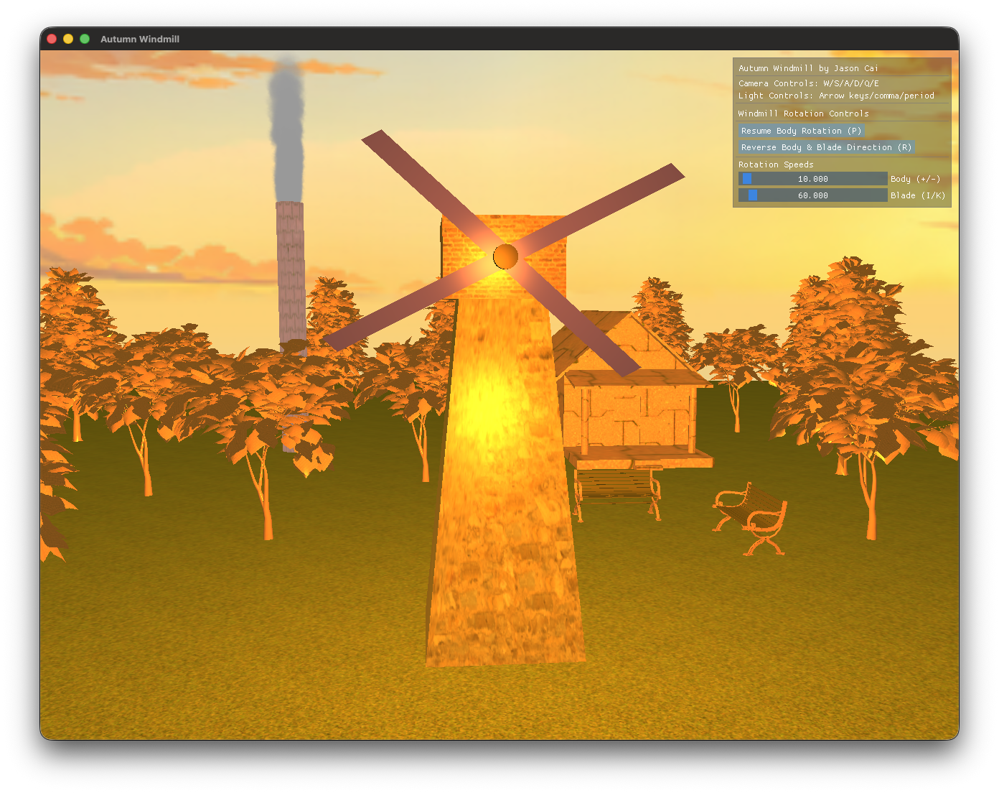

# graphics-autumn-windmill

**Personal repo of assignments for DI41008 - Graphics**

A lovely Autumn Windmill implemented in OpenGL. I don't claim this is an A-grade submission!!! As it genuinely lacks creativity (and I'm clearly NOT a graphics expert). For reference only.

**NOTE: This project is compatible with both Windows 11 and macOS (Apple Silicon), but it is STRONGLY recommended to run it on a Mac (with Apple Silicon).**

By Jason Cai

## Controls

A GUI control panel is available in the upper-right corner of the window to control rotation-related animations.

- Camera: W/S/A/D/Q/E to move (forward/back/left/right/down/up), camera always looks at the windmill
- Light: Arrow keys left/right/up/down for x/y, comma/period for z
- Blades rotation speed: I to increase, K to decrease
- P to pause/resume windmill main body rotation
- Windmill main body rotation speed: + to increase, - to decrease
- R to reverse all rotation directions (main body & blades)
- ESC to exit

## Resources Used

### Libraries

This project utilizes the following open-source libraries:

Assimp: https://www.assimp.org/

Dear ImGui: https://github.com/ocornut/imgui

### Textures

This project utilizes the following open-source textures:

Chimney: https://ambientcg.com/view?id=PavingStones135

Ground: https://ambientcg.com/view?id=Grass004

Skybox: https://freestylized.com/skybox/sky_15/

Smoke Particle: https://toppng.com/free-image/smoke-particle-texture-PNG-free-PNG-Images_70935

Windmill Cap: https://ambientcg.com/view?id=Bricks094

Windmill Tower: https://ambientcg.com/view?id=Bricks099

### Models

This project utilizes the following open-source models:

Bench: https://free3d.com/3d-model/bench-84662.html

Cabin: https://free3d.com/3d-model/old-farm-house-91130.html

Tree (Type A): https://free3d.com/3d-model/tree-74556.html

Tree (Type B): https://free3d.com/3d-model/tree02-35663.html
