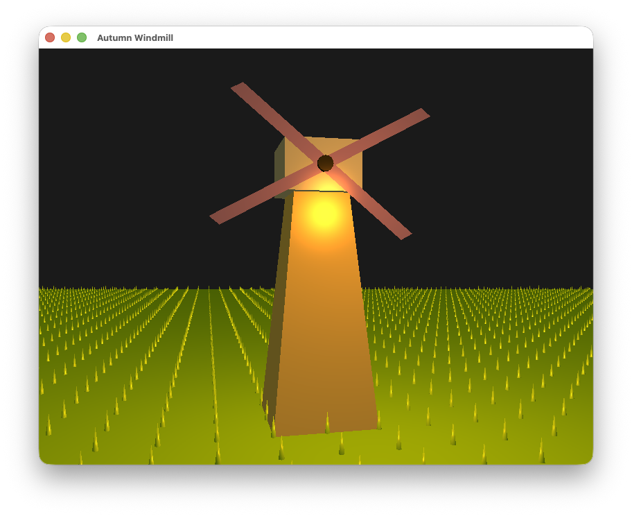

# graphics-action-scene

**Personal Repo of DI41008 - Graphics Assignment 1: Action Scene**

A lovely Autumn Windmill implemented in OpenGL.

By Jieshen Cai

## Controls

- Camera: W/S/A/D/Q/E to move (forward/back/left/right/down/up), camera always looks at the windmill
- Light: Arrow keys left/right/up/down for x/y, comma/period for z
- Blades rotation speed: I to increase, K to decrease
- P to pause/resume windmill main body rotation
- Windmill main body rotation speed: + to increase, - to decrease
- R to reverse all rotation directions (main body & blades)
- ESC to exit